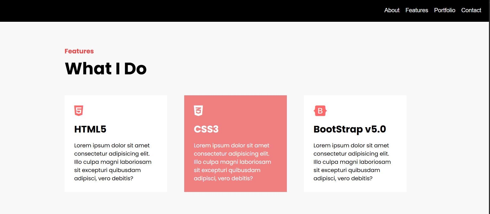
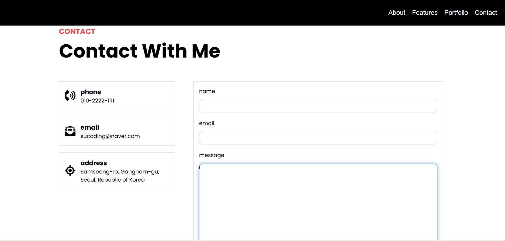

# 📃 Portfolio Practice Projects
- **반응형 웹 구조 설계, UI Interaction 구현** 등을 활용한 프론트엔드 개발 및 주요 기능 학습
- 직접 디자인한 My Portfolio 개발

  *참고 교재: 코딩자율학습 HTML +CSS +자바스크립트

 

 

# 🛠 기술 스택

- HTML 5, CSS 3, JavaScript (ES6)

 

# 🎯 프로젝트 목록
| No | Project | Path | Description |
|------|--------------------|-----------|------|
| 1 | 🎵 Portfolio Practice | [🔗 보기](./cozadan-practice) | Practice project from a web portfolio development training  |
| 2 | 🎞 My Portfolio | [🔗 보기](./) | Development of my own customized web portfolio |

 

## 1. 🎵 Portfolio Practice

✅ 기본 기능
- **Skills, Portfolio, Contact** Section 포함
- Sticky Navigation Bar, Hero Section
- Hover, Click에 따른 CSS 스크롤 애니메이션 적용

 
<caption>🗨 Main Section</caption>
 

  
  

- Main 소개글 타이핑 애니매이션
- 포트폴리오 다운로드 버튼
- Nav 클릭 시 해당 Section으로 이동하는 스크롤 애니매이션

 
<caption>🗨 About Section</caption>
 

- 인터랙티브 요소 구현 (SNS 이동 버튼)

 
<caption>🗨 Do Section</caption>
 

  
  

- 마우스 Hover 시 박스 UI 요소의 색상 변경

 
<caption>🗨 Hero Image Section</caption>
 

- 스크롤 시 Hero Image로 콘텐츠 전환

 
<caption>🗨 Portfolio Section</caption>
 

- main image 보이도록

 
<caption>🗨 Contact Section</caption>
 

  
  

- Contact Page box 클릭 디자인

## 2. 🎞 My Portfolio

✅ 기본 기능

## 👤 개발자 노트
프론트엔드 개발 학습으로 브라우저 API부터 동적 UI까지 단계적 학습 완료

